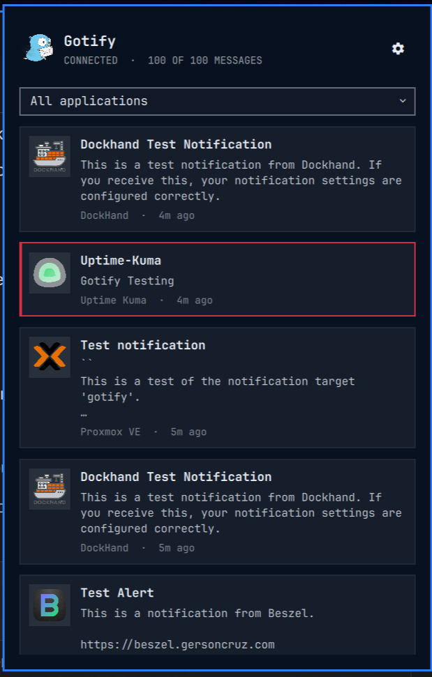
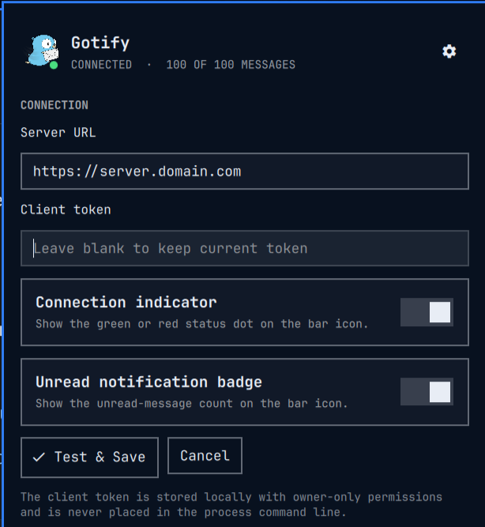

# Gotify for Omarchy

A Gotify inbox for the Omarchy Quattro bar. It delivers new Gotify messages
through Omarchy's native notification service and keeps recent messages in a
scrollable, searchable panel.

## Features

- Native desktop notifications with channel icons and priority-aware urgency
- Catch-up summaries after lock, sleep, or connection gaps instead of notification storms
- A master desktop-notification switch that leaves polling and inbox history active
- Unread badge and connection-status indicator, both optional
- Searchable filtering across every application configured in Gotify
- Configurable message-history size with paginated offline catch-up
- Application logos, readable message previews, and relative timestamps
- Click-through to safe HTTP(S) links supplied by Gotify messages
- In-panel server and client-token configuration

## Requirements

- Omarchy Quattro
- A reachable Gotify server and a Gotify **client token**
- `bash`, `curl`, `jq`, `flock`, and `xdg-open`

These command-line dependencies are present in a standard Omarchy installation.
The plugin does not require root access or install a system service.

## Install

```sh
omarchy plugin add https://github.com/yey3men2/omarchy-gotify.git --enable
```

Click the Gotify icon, select the gear, enter the server URL and client token,
then choose **Test & Save**. Create client tokens from Gotify's **Clients** page;
an application token will not work.

## Usage

- Click the bar icon to open or close the inbox.
- Select the application field to search or filter by sender.
- Click a message to open its HTTP(S) action URL, or the Gotify server when no
  safe action URL is present.
- Middle-click the bar icon to request an immediate refresh.
- Use the gear to update the connection, notification, and indicator preferences.

Desktop notifications are enabled by default. When catch-up summaries are
enabled, multiple messages accumulated while the session was locked produce one
summary. After a sleep or connection gap longer than 90 seconds, a summary is
used when the queued messages exceed the configured individual-message limit.
Messages received normally while the session is active remain individual. Up
to two critical catch-up messages can still appear individually. The limit is
configurable from 1 to 20 and defaults to five.

The inbox history size can be set to 25, 50, 100, 200, or 500 and defaults to
100. Offline and locked-session catch-up follows Gotify's pagination until it
reaches the last processed message, independently of the inbox history size.

The first successful connection establishes a baseline, so existing messages
are not replayed as desktop popups. Disabling desktop notifications does not
stop polling, history collection, unread counts, or the connection indicator.
New messages are checked every 15 seconds.

## Testing

Run the isolated bridge regression suite with:

```sh
tests/test-gotify-bridge
```

## Preview



<details>
<summary>Settings</summary>



</details>

## Security and privacy

- The client token is stored at `~/.config/omarchy/gotify/config.json` with
  owner-only (`0600`) permissions.
- Tokens are passed to the helper over standard input and to Gotify through the
  `X-Gotify-Key` request header. They are not placed in process arguments or
  URLs.
- Message action links are restricted to HTTP and HTTPS URLs.
- The plugin runs entirely as the current user and does not request elevated
  privileges.
- Message text and application metadata are requested directly from the Gotify
  server configured by the user.

Runtime state is stored in `~/.local/state/omarchy-gotify/`.

## Remove

```sh
omarchy plugin remove yey3men2.gotify
```

Removing the plugin does not delete the local token or runtime state. To erase
those files too:

```sh
rm -r ~/.config/omarchy/gotify ~/.local/state/omarchy-gotify
```

## License

The plugin code is available under the [MIT License](LICENSE). Gotify artwork
has separate attribution and licensing documented in
[THIRD_PARTY_NOTICES.md](THIRD_PARTY_NOTICES.md).
